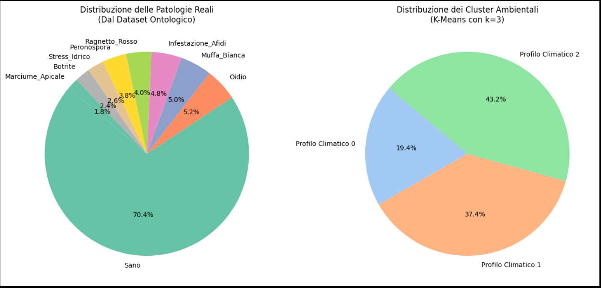
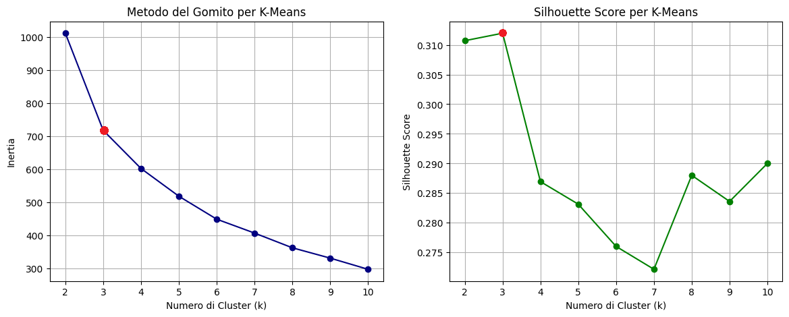
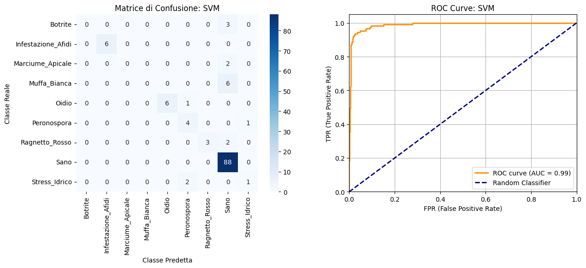
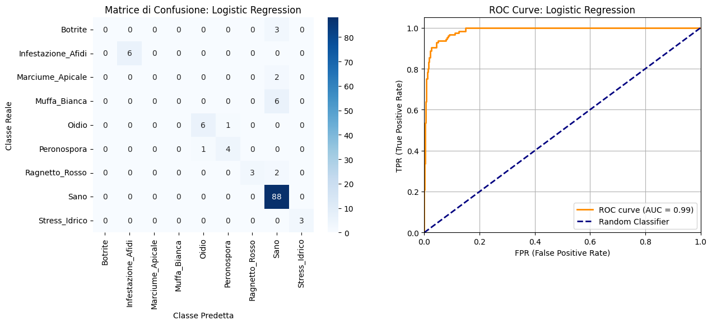
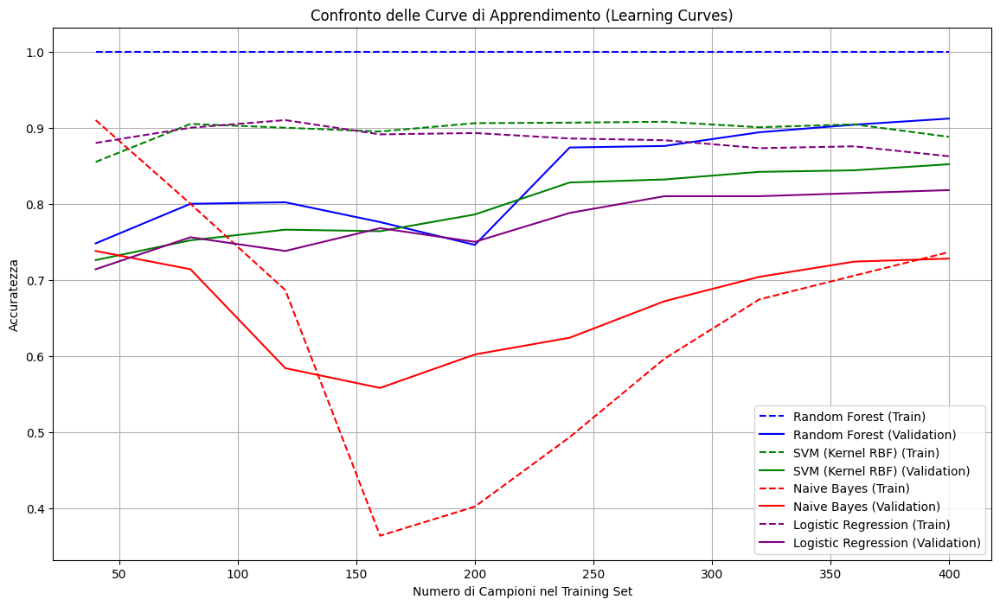
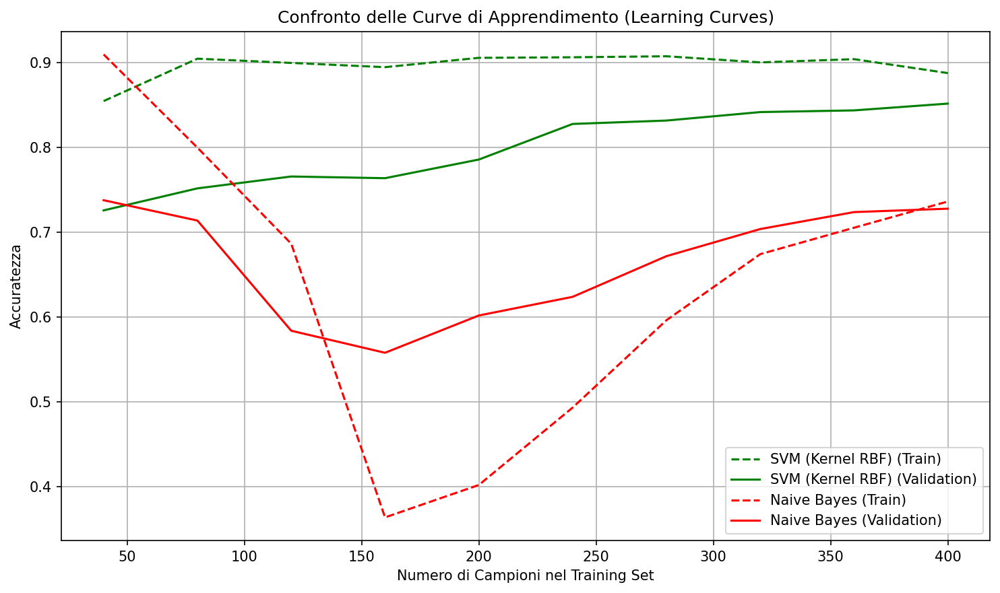
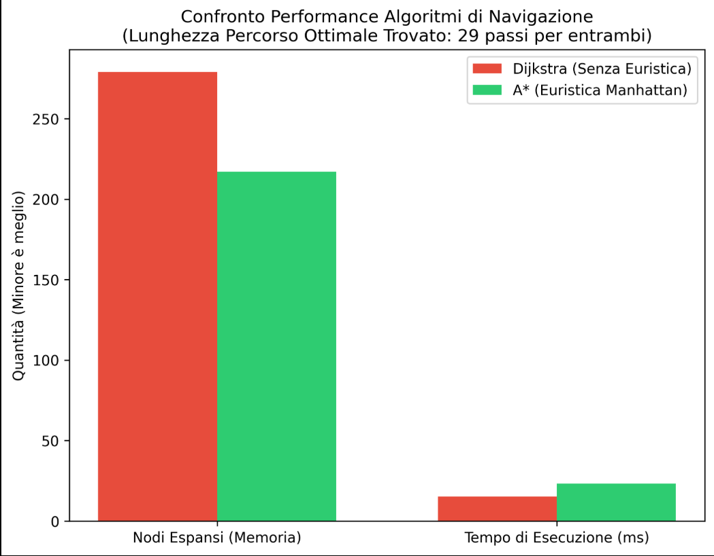
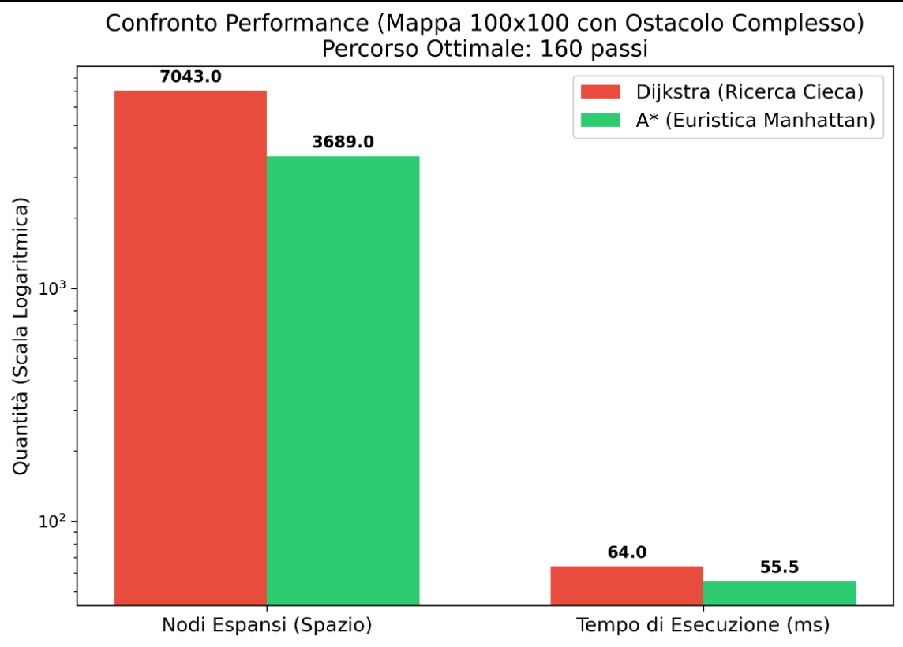

# **"Green Leaf - Giardino intelligente" documentazione**

## Gruppo di lavoro:
- ### Marco Pio Cascella, Matr: 796170, m.cascella10@studenti.uniba.it

- ### Angelo Piccolo, Matr: 802314, a.piccolo34@studenti.uniba.it

Repository Github: https://github.com/CascMark/Progetto-ICON-A.A.-2025-2026

Progetto dell'esame di "Ingegneria della conoscenza" A.A. 2025-26

## **Introduzione**
L'idea principale al centro di "Green Leaf" è progettare un sistema capace di classificare malattie che possono presentarsi all'interno di determinate specie di piante, supportando l'utente nella loro individuazione e suggerendo efficaci consigli per cure e rimedi, permettendo di poter costruire in totale salute e semplicità il proprio giardino.

### Requisiti funzionali
- Linguaggio di programmazione del progetto: Python (3.11.9)
- IDE: Visual Studio Code (VSC)

### Librerie utilizzate
- owlready2
- pgmpy
- pyswip
- pandas
- scikit-learn
- numpy
- python-constraint 
- tkinter

### Avvio
Il programma è avviabile mediante il file "GreenLeaf.bat" presente nella directory di progetto, oppure manualmente eseguendo all'interno di un IDE il file "main.py" presente nella directory /src. 
 
## **Sommario**
Green Leaf è un sistema basato su conoscenza (Knowledge-Based System, KBS) progettato per la diagnosi di malattie fitosanitarie e il supporto alla cura di piante da giardino e da orto. L'architettura del sistema segue un approccio ibrido, integrando tecniche di ragionamento simbolico con metodi di apprendimento automatico, al fine di garantire diagnosi accurate, interpretabili e contestualizzate.

Il componente centrale del sistema è una Knowledge Base articolata su due livelli: un livello logico-dichiarativo, implementato in Prolog, che codifica regole di diagnosi, mapping tra etichette prodotte dai modelli ML e i nomi interni della base di conoscenza (es. map_malattia('Infestazione_Afidi', 'Afidi')), e regole di trattamento per ciascuna patologia riconosciuta (es. trattamento('Oidio', 'Zolfo_Bagnabile_o_Bicarbonato')); e un livello ontologico, rappresentato tramite un'ontologia OWL, che formalizza la gerarchia tassonomica delle specie vegetali supportate e le loro proprietà biologiche — come il fabbisogno di luce, umidità, temperatura e pH del suolo — rendendole interrogabili in modo strutturato.

Il KBS implementa cinque moduli specializzati che coprono i principali paradigmi dell'Intelligenza Artificiale:

- Il modulo di apprendimento supervisionato addestra e confronta cinque algoritmi di classificazione — Random Forest, Rete Neurale (MLP), SVM con kernel RBF, Naive Bayes e Regressione Logistica — sul dataset delle osservazioni sintomatiche, valutandoli tramite 10-Fold Cross-Validation Stratificata. I modelli Random Forest e Rete Neurale vengono selezionati come modelli operativi per l'inferenza, e le loro predizioni vengono confrontate a runtime tramite un meccanismo di consenso multi-modello che segnala eventuali discordanze diagnostiche.

- Il modulo di apprendimento non supervisionato applica l'algoritmo K-Means per profilare la pianta nel suo contesto climatico sulla base delle condizioni ambientali rilevate, classificandola in categorie come "Clima Secco/Soleggiato", "Clima Umido/Ombroso" o "Clima Temperato/Neutro".

- Il modulo probabilistico implementa una Rete Bayesiana con distribuzioni di probabilità condizionate (CPD), che permette di stimare la probabilità delle cause patologiche sottostanti dato un sintomo osservato.

- Il modulo CSP (Constraint Satisfaction Problem) sfrutta i dati ontologici per determinare il posizionamento ottimale della pianta tra i vasi disponibili, soddisfacendo i vincoli biologici di luce e umidità propri di ciascuna specie.

- Il modulo di validazione genera report tabellari con le metriche di qualità dei modelli supervisionati, consultabili direttamente dall'utente tramite l'interfaccia grafica del sistema.

## **Elenco argomenti di interesse**

| Sezione | Pagina |
| :--- | ---: |
| [1. Creazione del dataset](#1-creazione-del-dataset).................................................................................................................................|3|   
| [2. Creazione dell'ontologia](#2-creazione-dellontologia)...........................................................................................................................|6| 
| [3. Ragionamento logico e Prolog](#3-ragionamento-logico-e-prolog)..............................................................................................................|7|     
| [4. Apprendimento non supervisionato](#4-apprendimento-non-supervisionato).....................................................................................................|8|   
| [5. Apprendimento supervisionato](#5-apprendimento-supervisionato)..............................................................................................................|9| 
| [6. Reti neurali](#6-reti-neurali)......................................................................................................................................................|14|     
| [7. Classificazione](#7-classificazione)...............................................................................................................................................|15|
| [8. CSP](#8-csp).....................................................................................................................................................................|17|
| [9. Ricerca nello spazio di stati](#9-ricerca-nello-spazio-di-stati)......................................................................................................................|19|
| [10. GUI](#10-gui)....................................................................................................................................................................|22|
| [11. Conclusioni](#11-conclusioni)....................................................................................................................................................|22|
| [12. Riferimenti bibliografici](#12-riferimenti-bibliografici)...........................................................................................................................| 23 |    

## **1. Creazione del dataset**

Creazione e Preprocessing del Dataset
A differenza degli approcci standard basati su dataset preesistenti (es. Kaggle), il dataset utilizzato per il presente progetto è stato generato dinamicamente a partire da una Knowledge Base Semantica (Ontologia OWL).

Attraverso un modulo "Dataset Builder" scritto in Python (sfruttando le librerie di ragionamento semantico), le proprietà logiche di centinaia di individui botanici sono state estratte dall'ontologia, combinate con variazioni stocastiche realistiche, ed esportate in un file CSV (piante_dataset.csv). Questo approccio ha permesso di creare un dataset perfettamente aderente al dominio del problema, testando la capacità dei modelli predittivi di apprendere regole formalizzate nel Web Semantico.

Il dataset contiene informazioni relative a diversi attributi biologici, climatici e sintomatologici delle piante, e serve per predire la specifica patologia (o lo stato di salute) che affligge l'esemplare.

Descrizione delle Features:
Le variabili indipendenti (features) estratte e utilizzate per l'addestramento rappresentano l'ambiente di crescita e lo stato fenotipico della pianta:

Features Categoriche (Biologiche e Sintomatologiche):

- Famiglia: La classificazione tassonomica della pianta (es. Solanaceae, Lamiaceae). Indica la predisposizione genetica a determinate patologie.

- Sintomi_Visivi: La manifestazione fisica e visibile del problema (es. Foglie_Gialle, Macchie_Fogliari, Nessuno). È il principale indicatore diagnostico primario.

- Features Numeriche (Ambientali e Climatiche):

- Ore_Luce: L'esposizione solare media giornaliera (misurata in ore) a cui la pianta è sottoposta.

- Umidita_Ottimale: Il fabbisogno idrico e l'umidità ambientale in cui la pianta si trova (valore continuo da 0.0 a 1.0).

- Temperatura_Ottimale: La temperatura media dell'ambiente di coltivazione (misurata in gradi Celsius).

- PH_Suolo: Il livello di acidità o basicità del terreno, fondamentale per l'assorbimento dei nutrienti (es. per evitare clorosi ferrica).

Variabile Target:

- Diagnosi_Reale: È la variabile dipendente che il sistema deve imparare a predire. Si tratta di un problema di classificazione multi-classe, dove le etichette rappresentano le specifiche patologie (es. Infestazione_Afidi, Muffa_Bianca, Peronospora, Carenza_Ferro) oppure lo stato Sano.

Preprocessing del dataset
Prima di fornire i dati in pasto agli algoritmi di Machine Learning, il dataset è stato sottoposto a una rigorosa pipeline di preprocessing all'interno del modulo train_model.py:

Importazione e Pulizia dei Dati: Il file CSV è stato importato tramite la libreria Pandas. I valori mancanti (NaN) per i sintomi o le famiglie sono stati gestiti inserendo le stringhe di default "Sconosciuta" o "Nessuno", per garantire la robustezza del sistema.

Separazione delle Variabili: Le feature (X) sono state isolate dalla variabile target (y) per il successivo processo di modellazione.

Encoding delle Variabili Categoriche: Gli algoritmi di apprendimento matematico richiedono input numerici. Le colonne di testo Famiglia e Sintomi_Visivi sono state trasformate in numeri interi tramite il Label Encoding (generando le colonne Famiglia_Encoded e Sintomo_Encoded). L'encoder è stato salvato su disco (.pkl) per poter decodificare i dati futuri inseriti dall'utente nella GUI.

Standardizzazione (Scaling): Poiché le feature numeriche hanno scale molto diverse (il pH va da 0 a 14, l'umidità da 0 a 1), è stata applicata la tecnica della standardizzazione tramite StandardScaler. Questo passaggio porta tutte le variabili ad avere media 0 e deviazione standard 1, un requisito fondamentale per far convergere e performare correttamente modelli basati sulle distanze (come le Support Vector Machine e il K-Means) e le Reti Neurali.

Gestione del Bilanciamento e Suddivisione: Per garantire che i modelli imparassero equamente tutte le patologie (anche quelle più rare generate dall'Ontologia), il dataset non è stato semplicemente tagliato. È stata utilizzata la tecnica della Stratified K-Fold Cross Validation (con K=10) abbinata a uno Stratified Train-Test Split, assicurando che la proporzione di ogni singola malattia rimanesse identica sia nei dati di addestramento che in quelli di validazione.

Prima di procedere con l'addestramento vero e proprio dei modelli, il dataset generato dall'Ontologia è stato rigorosamente suddiviso in due sottoinsiemi distinti per evitare il fenomeno dell'overfitting e permettere una valutazione oggettiva:
- Training set: una porzione maggioritaria dei dati (75%) utilizzata per addestrare i modelli e far loro apprendere le regole che legano le feature ambientali alle diagnosi.
- Test set: la restante porzione (25%) mantenuta "nascosta" al modello durante l'addestramento e utilizzata esclusivamente per testarne le prestazioni predittive su dati mai visti prima.
A livello implementativo, questa suddivisione è stata effettuata avvalendosi della funzione train_test_split messa a disposizione dalla libreria sklearn.model_selection:

Suddivisione del dataset in train (75%) e test (25%) con stratificazione
X_train, X_test, y_train, y_test = train_test_split(X, y, test_size=0.25, random_state=42, stratify=y)

 La configurazione di questa funzione non è stata casuale, ma ha risposto a specifiche esigenze architetturali del dominio botanico in esame:
- test_size=0.25: Definisce la proporzione del taglio (Hold-out), allocando esattamente un quarto delle piante virtuali alla fase di testing diagnostico visivo.
- random_state=42: Imposta un "seed" fisso per il generatore di numeri pseudo-casuali. Questo garantisce la totale riproducibilità dell'esperimento scientifico; a ogni esecuzione del codice, la distribuzione casuale delle piante nei due insiemi rimarrà identica.
- stratify=y (Bilanciamento Multi-classe): Questo è il parametro cruciale dell'operazione. Trattandosi di un problema di classificazione multi-classe basato su estrazioni stocastiche da una Knowledge Base, un taglio puramente casuale avrebbe rischiato di escludere del tutto dal test set le malattie più rare (sbilanciando la valutazione). Il parametro stratify forza l'algoritmo a mantenere nel test set la stessa identica distribuzione percentuale di classi (patologie) presente nel dataset originale.

È fondamentale precisare che questo specifico split 75/25 (Hold-out) è stato utilizzato per l'estrazione grafica delle Matrici di Confusione e per il calcolo delle Curve ROC. Tuttavia, per garantire il massimo rigore statistico (Model Selection) e calcolare le metriche ufficiali presentate nell'interfaccia grafica del sistema (Accuratezza Media, Varianza, F1-Score), il modulo di Machine Learning principale utilizza una 10-Fold Stratified Cross-Validation, eliminando così qualsiasi "bias" derivante da un singolo taglio fortunato dei dati.

Per comprendere a fondo la struttura del dataset generato dinamicamente dall'Ontologia e interpretare correttamente i risultati degli algoritmi di clustering e classificazione, è stata condotta un'analisi visiva delle distribuzioni tramite grafici a torta.

Il grafico a sinistra illustra la ripartizione delle etichette diagnostiche all'interno della Knowledge Base. Emerge immediatamente una caratteristica fondamentale del dataset: il forte sbilanciamento fisiologico delle classi.
- La classe maggioritaria: Oltre il 70% (70.4%) delle istanze generate appartiene alla classe Sano. Questo dato modella in modo estremamente realistico un contesto agricolo o botanico reale, in cui la condizione di normalità e salute è statisticamente predominante rispetto allo stato patologico.
- Le classi minoritarie: Il restante 30% circa del dataset è frammentato in diverse patologie specifiche (Oidio, Muffa Bianca, Infestazione Afidi, ecc.), le cui incidenze variano dal 5.2% fino all'1.8% del Marciume Apicale.
- Implicazioni progettuali: Aver evidenziato questa distribuzione giustifica rigorosamente le scelte metodologiche effettuate nelle fasi successive del progetto. Un dataset così sbilanciato rende l'Accuratezza (Accuracy) una metrica potenzialmente fuorviante. Ciò ha reso obbligatorio l'uso dell'F1-Score per la valutazione dei classificatori e l'impiego della tecnica di Stratified Cross-Validation (Split Stratificato) per garantire che le malattie più rare non venissero escluse durante il partizionamento tra set di addestramento e test.

Il grafico a destra mostra il risultato dell'apprendimento non supervisionato, nello specifico il partizionamento dei dati climatici effettuato dall'algoritmo K-Means con $k=3$.
A differenza della variabile target, i profili climatici risultano ben distribuiti:
- Il Profilo Climatico 2 è il più frequente, coprendo il 43.2% dell'ambiente simulato.
- Segue il Profilo Climatico 1 con il 37.4%.
- Il Profilo Climatico 0 rappresenta una nicchia ambientale più ristretta, pari al 19.4%.

Questa eterogeneità conferma che il "Dataset Builder" basato sull'Ontologia ha lavorato correttamente: non ha generato un ambiente piatto e monotono, ma ha simulato con successo tre macro-climi ben distinti. È proprio all'interno di questa ricca varietà ambientale che i modelli supervisionati (come la Random Forest e la SVM) hanno dovuto cercare le correlazioni nascoste per scovare quel 30% di piante malate.

## **2. Creazione dell'ontologia**

 Rappresentazione della Conoscenza: Creazione dell'Ontologia OWLIl cuore logico e semantico del progetto "Green Leaf" è costituito da un'ontologia formalizzata in linguaggio OWL (Web Ontology Language). A differenza degli approcci standard che si affidano esclusivamente a dataset tabulari pre-compilati, questo sistema adotta il paradigma ML+OntoBK (Machine Learning integrato con Background Knowledge).
 
 L'obiettivo dell'ontologia non è fungere da semplice database statico, ma fornire una Knowledge Base (KB) strutturata e inferenziale che descriva il dominio della botanica, della patologia vegetale e delle condizioni ambientali, permettendo al sistema di "ragionare" sulle relazioni di causa-effetto prima ancora di applicare l'apprendimento statistico.2.1 Strumenti di SviluppoL'ontologia (Ontologia_Completa.owx) è stata inizialmente progettata e modellata utilizzando l'editor Protégé, per garantire la correttezza formale della sintassi OWL e validare la consistenza logica tramite un Reasoner (es. HermiT).
 
 Successivamente, per l'integrazione a livello software e la manipolazione dinamica all'interno della pipeline di Intelligenza Artificiale, è stata impiegata la libreria Python Owlready2. Questa libreria ha permesso di interrogare il grafo semantico e di generare dinamicamente il dataset per l'addestramento dei modelli.
 

 
  TBox: Terminologia e Tassonomia delle ClassiLa Terminological Box (TBox) definisce i concetti chiave del dominio. La tassonomia è stata strutturata in macro-classi gerarchiche per consentire il ragionamento sussuntivo (ereditarietà delle proprietà):
  
  - Pianta: La classe radice per gli individui biologici. È stata ulteriormente specializzata in sottoclassi che rappresentano le famiglie botaniche (es. Solanaceae, Lamiaceae, Rosaceae), ciascuna con specifiche vulnerabilità intrinseche.
  
  - Sintomo: Rappresenta le manifestazioni fisiche osservabili (es. Foglie_Gialle, Macchie_Fogliari, Marciume_Apicale).Malattia: Classifica le patologie e gli stress (es. Infestazione_Afidi, Peronospora, Carenza_Ferro). Questa classe rappresenta il target delle predizioni del sistema.
  
  - Ambiente / FattoreClimatico: Modella i parametri fisici quantitativi (Luce, Umidità, Temperatura, pH) che fungono da vincoli o concause per lo sviluppo delle malattie.2.3 ABox e Object/Data PropertiesPer superare i limiti del semplice "pattern matching" e dotare l'ontologia di vera ricchezza semantica, le classi sono state collegate tramite Object Properties (relazioni tra concetti) e Data Properties (attributi quantitativi).
  
  Alcune delle proprietà fondamentali definite includono:
  
  haSintomo (Domain: Pianta -> Range: Sintomo)
  causataDa (Domain: Malattia -> Range: FattoreClimatico) haValorePH, haOreLuce (Data Properties con restrizioni di dominio per modellare i fabbisogni specifici delle singole famiglie botaniche). Attraverso queste proprietà, l'ontologia non si limita a dichiarare che "il Basilico è una Pianta", ma stabilisce regole complesse del tipo: Una pianta appartenente alla famiglia delle Solanaceae, se esposta a umidità > 0.8 e che presenta il sintomo Macchie_Fogliari, ha un'alta probabilità di contrarre una malattia fungina.
  
  Generazione del Dataset tramite Inferenza (Dataset Builder), l'ontologia è stata impiegata come Generatore (Dataset Builder).
  
  Invece di compilare manualmente i dati storici, il modulo Python ha utilizzato l'ontologia per instanziare centinaia di individui (ABox) in base alle regole logiche definite.
  
  Ad ogni individuo sono stati assegnati valori stocastici di luce, temperatura e sintomi, rispettando però i vincoli biologici imposti dalle gerarchie OWL.
  
  Questo approccio garantisce che il Machine Learning operi su dati semanticamente fondati, unendo la capacità di generalizzazione statistica (Supervised Learning) con il rigore formale delle Logiche Descrittive (DL) proprie del Web Semantico.

## **3. Ragionamento logico e Prolog**

Il livello logico-dichiarativo del sistema è implementato tramite la Knowledge Base Prolog (kb.pl), consultata a runtime attraverso il bridge pyswip, che consente di lanciare query Prolog direttamente dal codice Python tramite la classe GardenLogic.

La KB si articola in tre strati di conoscenza. Il primo è un insieme di fatti di mapping (map_malattia/2), che svolgono la funzione di ponte tra il vocabolario prodotto dai modelli ML e i nomi interni della base di conoscenza: ad esempio, l'etichetta 'Infestazione_Afidi' restituita dal classificatore viene ricondotta al termine 'Afidi' usato nelle regole di trattamento. Un predicato di fallback garantisce che qualsiasi etichetta non mappata esplicitamente venga comunque accettata invariata.

Il secondo strato è composto dai fatti di trattamento (trattamento/2), che associano a ciascuna patologia riconosciuta la terapia agronomica raccomandata, dalla somministrazione di specifici antiparassitari o fungicidi fino alla rimozione della pianta in caso di virosi incurabile. La regola principale trova_cura/2 orchestra l'intero processo: riceve la diagnosi prodotta dal modulo ML, applica il mapping, recupera il trattamento corrispondente e, qualora non venga trovata alcuna corrispondenza, restituisce un'indicazione di fallback che invita a consultare un agronomo.

Il terzo strato è costituito dalle regole di diagnosi logica (diagnosi/3), che codificano la conoscenza agronomica di dominio sotto forma di fatti dichiarativi, associando a ciascuna coppia pianta-sintomo la patologia attesa (es. diagnosi('Rosa', 'Muffa_Bianca', 'Oidio')). Questo strato viene interrogato dalla regola verifica_consistenza/3 per effettuare un cross-check tra la diagnosi suggerita dal modulo ML e quella derivabile dalla KB simbolica, permettendo al sistema di rilevare eventuali incoerenze tra i due livelli di ragionamento.

## **4. Apprendimento non supervisionato**

Il modulo di apprendimento non supervisionato ha il compito di profilare le osservazioni in base alle sole condizioni ambientali rilevate, prescindendo dall'etichetta diagnostica. A differenza del modulo supervisionato, che risponde alla domanda "di quale malattia soffre la pianta?", il clustering risponde alla domanda "in quale contesto climatico si trova la pianta?", producendo un'informazione complementare e contestuale alla diagnosi. I cluster individuati vengono interpretati semanticamente come categorie climatiche — Clima Secco/Soleggiato, Clima Umido/Ombroso e Clima Temperato/Neutro — e contribuiscono a fornire al sistema una visione più articolata dello stato della pianta, utile anche per orientare i consigli di cura.

Il modulo è implementato tramite la classe KMeans della libreria scikit-learn [1]. Il modello addestrato, insieme al relativo scaler ambientale, viene serializzato tramite joblib e ricaricato a runtime dal motore di inferenza GardenMLEngine.

Le feature utilizzate per il clustering sono esclusivamente quelle ambientali: ore di luce, umidità ottimale e temperatura ottimale. La scelta di escludere le feature diagnostiche (famiglia botanica, sintomi, pH) è motivata dall'obiettivo di far emergere una struttura latente legata al contesto climatico, non alla patologia, evitando che il clustering replichi semplicemente le etichette già note al modulo supervisionato.

Un aspetto critico riguarda il preprocessing: per il clustering è stato adottato uno StandardScaler dedicato e completamente separato da quello utilizzato per i modelli supervisionati. Questa scelta è necessaria perché i due pipeline operano su insiemi di feature differenti (3 vs 6 colonne): condividere il medesimo scaler avrebbe prodotto trasformazioni errate e risultati non interpretabili.

Il numero di cluster è stato fissato a 3, una scelta motivata sia dalla valutazione del metodo del gomito (Elbow Method) — visibile nel plot 01_kmeans_evaluation.png generato dallo script generate_plots.py — sia dalla coerenza semantica: tre categorie climatiche risultano sufficientemente espressive per il dominio in esame senza introdurre una granularità eccessiva difficile da interpretare agronomicamente.

La scelta di k=3 è stata supportata da due metriche complementari, calcolate per valori di k compresi tra 2 e 10 e visualizzate nel plot 01_kmeans_evaluation.png generato dallo script generate_plots.py.

La prima è la curva dell'inerzia intra-cluster (Metodo del Gomito): all'aumentare di k, l'inerzia decresce progressivamente, ma la riduzione diventa via via meno significativa. Il punto di inflessione più marcato si osserva in corrispondenza di k=3, oltre il quale l'aggiunta di nuovi cluster produce benefici marginali, suggerendo che tre gruppi rappresentino un buon equilibrio tra compattezza e semplicità del modello.

La seconda è il Silhouette Score, che misura per ciascun punto quanto esso sia simile agli altri elementi del proprio cluster rispetto a quelli del cluster più vicino; valori prossimi a 1 indicano una separazione netta tra i cluster, valori prossimi a 0 segnalano sovrapposizione. L'andamento del Silhouette Score al variare di k ha confermato k=3 come scelta solida, mostrando un valore elevato e stabile rispetto alle alternative, a indicare che i tre cluster individuati sono internamente coesi e sufficientemente separati tra loro. Le due metriche, concordando sulla stessa scelta, hanno rafforzato la robustezza della decisione progettuale.

## **5. Apprendimento supervisionato**

Il modulo di apprendimento supervisionato ha il compito di classificare lo stato fitosanitario di una pianta a partire dalle sue osservazioni sintomatiche e ambientali. Il problema è trattato come un task di classificazione multiclasse su 9 etichette diagnostiche (Sano, Infestazione_Afidi, Oidio, Peronospora, Botrite, Muffa_Bianca, Ragnetto_Rosso, Marciume_Apicale, Stress_Idrico). Sono stati addestrati e confrontati quattro modelli — Random Forest, SVM con kernel RBF, Naive Bayes e Regressione Logistica — con l'obiettivo di individuare quello più adatto a essere impiegato come modello operativo nel sistema, affiancato alla Rete Neurale trattata separatamente.

I modelli sono implementati tramite le classi RandomForestClassifier, SVC, GaussianNB e LogisticRegression della libreria scikit-learn. La validazione è condotta tramite StratifiedKFold e cross_validate, mentre il calcolo dell'AUC multi-classe è effettuato tramite roc_auc_score con strategia One-vs-One. Il preprocessing delle feature categoriche (famiglia botanica e sintomi visivi) è affidato a LabelEncoder, mentre la normalizzazione dell'intero vettore di input è gestita da StandardScaler.

Le feature di input sono sei: famiglia botanica codificata, sintomi visivi codificati, ore di luce, umidità ottimale, temperatura ottimale e pH del suolo. Le prime due sono variabili categoriche trasformate tramite label encoding; le restanti quattro sono variabili numeriche continue. L'intero vettore viene standardizzato con StandardScaler prima di essere fornito ai modelli, scelta necessaria in particolare per SVM e Regressione Logistica, che sono sensibili alla scala delle feature.
La validazione è stata condotta tramite 10-Fold Cross-Validation Stratificata, che preserva in ciascun fold la distribuzione originale delle classi. Il Random Forest, una volta selezionato come modello operativo, viene addestrato sull'intero dataset e serializzato tramite joblib insieme allo scaler e agli encoder, per essere ricaricato a runtime dal motore di inferenza GardenMLEngine.

Per ciascun modello sono riportate le metriche mediate sui 10 fold: accuratezza, varianza e deviazione standard dell'accuratezza, F1-score pesato, precisione media pesata e AUC (One-vs-One). La varianza e la deviazione standard forniscono un'indicazione sulla stabilità del modello al variare della partizione di training e test.

| Algoritmo | Accuratezza | Varianza | Dev. Std. | F1-score | AVG(P) | AUC |
|---|---|---|---|---|---|---|
| Random Forest | 0.930 | 0.00026 | 0.016 | 0.899 | 0.870 | 0.984 |
| Neural Network | 0.896 | 0.00110 | 0.033 | 0.879 | 0.869 | 0.955 |
| SVM (Kernel RBF) | 0.870 | 0.00090 | 0.030 | 0.820 | 0.784 | 0.947 |
| Naive Bayes | 0.742 | 0.00156 | 0.039 | 0.789 | 0.869 | 0.989 |
| Logistic Regression | 0.848 | 0.00074 | 0.027 | 0.793 | 0.756 | 0.949 |

### Random Forest
Il Random Forest è un metodo ensemble che costruisce un insieme di alberi decisionali addestrati su sottocampioni casuali del dataset e delle feature, aggregando le predizioni tramite voto di maggioranza. È stato configurato con n_estimators=100, valore che garantisce stabilità delle predizioni senza introdurre un costo computazionale eccessivo. Si afferma come il modello più performante dell'intera valutazione, con un'accuratezza di 0.930 e un'AUC di 0.984, abbinati alla varianza più bassa (0.00026), a indicare un comportamento stabile e consistente attraverso tutti i fold. Grazie a questi risultati, il Random Forest è stato selezionato come modello operativo del sistema.

La matrice evidenzia un comportamento complessivamente molto solido. La classe dominante, Sano, viene classificata correttamente in 87 casi su 88, con un solo errore verso Oidio. Tutte le classi patologiche minori — Infestazione_Afidi (6/6), Ragnetto_Rosso (5/5), Peronospora (5/5), Stress_Idrico (3/3), Botrite (3/3) — vengono riconosciute senza alcun errore. L'unica criticità riguarda Marciume_Apicale, classificato correttamente solo 0 volte su 2, con entrambi i campioni erroneamente assegnati alla classe Sano, e Oidio, che genera una confusione con Peronospora in un caso. Questo comportamento è riconducibile alla bassa numerosità di queste classi nel test set, che rende il modello meno capace di distinguerle in fase di predizione.

La curva ROC mostra un'AUC di 0.99, con un profilo che si avvicina quasi immediatamente all'angolo superiore sinistro del grafico, indicando un'ottima capacità discriminativa tra le classi. Il modello raggiunge un TPR molto elevato già a valori di FPR prossimi a zero, confermando che le probabilità di classe stimate sono ben calibrate e separano efficacemente le diagnosi corrette da quelle errate.

### SVM con Kernel RBF

La Support Vector Machine con kernel RBF (Radial Basis Function) proietta implicitamente i dati in uno spazio di feature ad alta dimensionalità, cercando l'iperpiano di separazione a margine massimo tra le classi. Il kernel RBF è stato scelto per la sua capacità di gestire relazioni non lineari tra le feature, caratteristica rilevante in un dominio dove la combinazione di sintomi e condizioni ambientali non produce confini di decisione lineari. Il parametro probability=True è stato abilitato per consentire il calcolo delle probabilità di classe necessarie alla stima dell'AUC. Il modello raggiunge un'accuratezza di 0.870 e un'AUC di 0.947, posizionandosi al secondo posto nella valutazione complessiva, con una varianza contenuta (0.00090).

L'analisi e la spiegazione avviene nel capitolo 7.

### Naive Bayes

Il Naive Bayes Gaussiano è un classificatore probabilistico che stima la probabilità di ciascuna classe assumendo l'indipendenza condizionale tra le feature e modellando le distribuzioni di probabilità come gaussiane. È il modello più semplice tra quelli valutati e non richiede alcun parametro di configurazione specifico. Presenta l'accuratezza più bassa (0.742) e la varianza più alta (0.00156), riflettendo la limitatezza dell'ipotesi di indipendenza in un contesto in cui le feature ambientali sono tra loro correlate. Tuttavia, registra un'AUC sorprendentemente elevata (0.989), la più alta dell'intera valutazione, suggerendo che il modello stima in modo affidabile le probabilità di appartenenza alle classi, pur commettendo più errori nella classificazione diretta.

L'analisi e la spiegazione avviene nel capitolo 7.

### Regressione logistica

La Regressione Logistica è un modello lineare generalizzato che stima la probabilità di appartenenza a ciascuna classe tramite una funzione sigmoide, estesa al caso multiclasse tramite la strategia One-vs-Rest. È configurata con max_iter=1000 per garantire la convergenza su un problema con nove etichette. Raggiunge un'accuratezza di 0.848 e un'AUC di 0.949, risultando competitiva rispetto alla SVM nonostante la sua natura lineare, il che suggerisce che una parte rilevante della struttura del problema sia linearmente separabile nello spazio delle feature normalizzate. La deviazione standard contenuta (0.027) conferma una buona stabilità tra i fold.

La Regressione Logistica mostra un comportamento simile alla SVM, con qualche debolezza aggiuntiva sulle classi minori. Sano viene classificato correttamente in tutti gli 88 casi. Infestazione_Afidi (6/6) e Muffa_Bianca (6/6) sono riconosciute perfettamente. Oidio genera una confusione con Peronospora in un caso (6/7), mentre Peronospora presenta lo stesso errore speculare (4/5). Botrite non viene mai classificata correttamente, con tutti e 3 i campioni assegnati a Sano, e Marciume_Apicale registra anch'essa 0 predizioni corrette con i 2 campioni assegnati a Sano. Questi errori riflettono i limiti di un modello lineare nel separare classi con distribuzioni di feature sovrapposte, in particolare quelle con numerosità ridotta nel test set.

La curva ROC mostra un'AUC di 0.99, in linea con Random Forest e SVM. Come già osservato per il Naive Bayes, l'AUC elevata indica che la stima probabilistica del modello è buona, anche nei casi in cui la classificazione diretta fallisce. Il profilo della curva è tuttavia leggermente meno ripido nelle fasi iniziali rispetto al Random Forest, coerente con la minore accuratezza media osservata in cross-validation.

### Analisi dei risultati per ogni modello

L'analisi delle learning curves (curve di apprendimento) è fondamentale per valutare le prestazioni dei modelli durante l'addestramento e per identificare eventuali problemi come overfitting o underfitting.

#### Random Forest (Linee Blu)

Training Score (Linea Tratteggiata): La curva del training score è incollata a un valore perfetto di 1.0 fin dall'inizio e rimane costante. Questo indica che il modello, grazie alla sua natura ad alberi decisionali, riesce a memorizzare e adattarsi perfettamente alla complessità dei dati di training in ogni fase.

Validation Score (Linea Continua): La curva del validation score parte da valori discreti (intorno a 0.75) e, dopo un brevissimo periodo di assestamento iniziale, aumenta in modo rapido e costante all'aumentare della dimensione del training set, arrivando a superare quota 0.90. Questo suggerisce che il modello non sta semplicemente imparando a memoria, ma generalizza in modo eccellente sui dati non visti.

#### Support Vector Machine - SVM Kernel RBF (Linee Verdi)

Training Score (Linea Tratteggiata): La curva del training score inizia alta (intorno a 0.85) e si mantiene estremamente stabile, crescendo in modo molto dolce fino ad assestarsi vicino allo 0.90. Questo indica che la SVM si adatta molto bene e in modo equilibrato ai dati di training.

Validation Score (Linea Continua): La curva del validation score inizia più bassa ma aumenta progressivamente e con grande regolarità, avvicinandosi sempre di più al training score man mano che il dataset cresce. La perfetta convergenza parallela tra le due curve dimostra che il modello SVM è incredibilmente robusto, impara dai nuovi esempi e non soffre minimamente di overfitting.

#### Regressione Logistica (Linee Viola)

Training Score (Linea Tratteggiata): La curva del training score inizia alta e decresce in modo quasi impercettibile e costante all'aumentare dei dati (scendendo gradualmente da 0.88 a 0.86). Questo è il comportamento ideale di un solido modello lineare che, ricevendo un numero maggiore di casi studio, smussa le proprie certezze iniziali per estrarre una regola più generale.

Validation Score (Linea Continua): La curva del validation score parte dal basso (circa 0.71) ma sale con una pendenza costante. A 400 campioni, la linea continua e quella tratteggiata si avvicinano fino a quasi sovrapporsi. Questa convergenza strettissima indica un modello estremamente "sano", che non soffre di overfitting e ha raggiunto il suo massimo potenziale predittivo logico-lineare.

#### Naive Bayes (Linee Rosse)

Training Score (Linea Tratteggiata): Il comportamento è atipico e rivelatore. Inizia molto alto (oltre 0.90), ma subisce un crollo drammatico e verticale intorno ai 160 campioni (scendendo sotto lo 0.40), per poi iniziare una lenta e faticosa risalita. Questo evidenzia un improvviso shock del modello (underfitting acuto) causato dall'introduzione di patologie complesse che violano la sua rigida assunzione matematica di "assoluta indipendenza tra i sintomi".

Validation Score (Linea Continua): Anche la curva di validazione subisce lo stesso trauma, crollando e poi risalendo in parallelo alla curva di training. Alla fine del dataset (400 campioni), le due curve convergono e si stabilizzano intorno allo 0.73. Il modello ha infine ricostruito una coerenza statistica tramite la legge dei grandi numeri, ma assestandosi su un livello di accuratezza nettamente inferiore rispetto agli altri algoritmi.

## **6. Reti neurali**

La Rete Neurale impiegata nel sistema è un Percettrone Multistrato (Multi-Layer Perceptron, MLP), un modello di apprendimento supervisionato che apprende una rappresentazione non lineare dei dati attraverso una serie di strati di neuroni connessi. Nel contesto del sistema, la rete neurale affianca il Random Forest come secondo modello operativo: entrambi producono una predizione indipendente per ogni osservazione, e le due diagnosi vengono confrontate a runtime dal modulo ValidationReporter tramite un meccanismo di consenso multi-modello, che segnala eventuali discordanze tra i due classificatori.

Il modello è implementato tramite la classe MLPClassifier della libreria scikit-learn. Come per gli altri modelli supervisionati, le feature di input vengono preprocessate tramite LabelEncoder per le variabili categoriche e normalizzate con StandardScaler. Il modello addestrato viene serializzato tramite joblib e ricaricato a runtime dal motore di inferenza GardenMLEngine.

L'architettura della rete è composta da due strati nascosti, rispettivamente di 64 e 32 neuroni (hidden_layer_sizes=(64, 32)), con funzione di attivazione ReLU applicata di default da scikit-learn. La scelta di due strati nascosti con dimensione decrescente riflette un approccio a imbuto: il primo strato apprende rappresentazioni più generali delle feature di input, mentre il secondo le raffina verso le 9 classi diagnostiche target. Il numero massimo di iterazioni è stato fissato a max_iter=1000 per garantire la convergenza su un problema multiclasse con un numero di epoche sufficiente, evitando i warning di convergenza prematura che si manifestavano con valori inferiori. La validazione è condotta, coerentemente con gli altri modelli, tramite 10-Fold Cross-Validation Stratificata.

La rete neurale raggiunge un'accuratezza di 0.896 e un'AUC di 0.955, posizionandosi al secondo posto nella classifica complessiva, subito dopo il Random Forest. Rispetto a quest'ultimo presenta una varianza leggermente più alta (0.00110 vs 0.00026), indicando una maggiore sensibilità alla specifica partizione dei dati nei fold, verosimilmente legata alla natura iterativa dell'ottimizzazione tramite gradient descent. L'F1-score pesato (0.879) e la precisione media (0.869) risultano comunque elevati e comparabili a quelli del Random Forest, confermando che il modello generalizza bene sul problema in esame. Il suo impiego in parallelo al Random Forest nel meccanismo di consenso è motivato proprio da questa complementarità: quando i due modelli concordano sulla diagnosi, il sistema può fornire una risposta con maggiore confidenza; in caso di discordanza, l'utente viene avvisato dell'incertezza diagnostica.

## **7. Classificazione**

Nella data science e nel machine learning, la scelta del modello giusto è cruciale per ottenere prestazioni ottimali su un dato problema. In questo contesto, i modelli Naive Bayes e Support Vector Machine (SVM) rappresentano due approcci diametralmente opposti per la classificazione: uno strettamente probabilistico e uno geometrico.

La presente sezione fornisce un confronto approfondito tra i due modelli, evidenziandone i comportamenti sui dati botanici generati dall'Ontologia.

- Naive Bayes: È un modello probabilistico basato sul teorema di Bayes con l'assunzione di forte indipendenza tra le caratteristiche (features). Questo modello calcola le probabilità a priori e a posteriori, ma risulta vulnerabile quando le variabili predittive sono fortemente correlate tra loro.
- Support Vector Machine (SVM): È un potente classificatore che cerca di trovare l'iperpiano ottimale che separa le classi nel miglior modo possibile, massimizzando il margine tra i punti di dati di diverse classi. Utilizzando un Kernel RBF, la SVM è in grado di mappare dati non lineari in dimensioni superiori, rendendola estremamente efficace per la classificazione multi-classe complessa.

Entrambi i modelli sono stati testati sul medesimo dataset di addestramento. Per una comparazione visiva e statistica, sono state analizzate le Matrici di Confusione, le Curve ROC (con i relativi AUC) e le Curve di Apprendimento.

SUPPORT VECTOR MACHINE (SVM):

- Spiegazione AUC = 0.99: L'area sotto la curva ROC è pari a 0.99, indicando un'ottima capacità discriminante del modello nell'isolare le diverse patologie.

- Matrice di Confusione: Il modello presenta una diagonale principale densamente popolata. Sebbene le performance siano eccellenti, si registra una lieve debolezza specifica (Falsi Negativi): la tendenza a confondere alcuni casi di Muffa_Bianca con la classe Sano, dovuta alla sovrapposizione intrinseca dei dati climatici iniziali di queste due condizioni.

NAIVE BAYES:

- Spiegazione AUC = 0.88: L'area sotto la curva ROC è inferiore rispetto alla SVM. Sebbene l'AUC generale sia accettabile, la capacità discriminativa crolla su specifiche malattie.
- Matrice di Confusione: Rispetto alla SVM, si nota una maggiore dispersione dei valori al di fuori della diagonale principale. Il modello fatica a classificare correttamente le malattie perché l'assunzione di "indipendenza dei sintomi" tipica del Naive Bayes non si sposa con la realtà botanica, dove sintomi come Foglie_Gialle e pH_Alterato sono biologicamente dipendenti.

Le curve di apprendimento mostrano come cambia la performance del modello (sia sul training set che sul validation set) in relazione al numero di esempi forniti. Le curve aiutano a capire se un modello sta soffrendo di overfitting o underfitting.

Support Vector Machine (SVM):
- Training Score e Validation Score: La curva del training score inizia alta e rimane stabile all'aumentare della dimensione del training set. Parallelamente, la curva di cross-validation aumenta costantemente, avvicinandosi al training score.
- Convergenza: Le curve convergono a un valore molto alto (> 0.85), indicando che il modello SVM non soffre di overfitting e si adatta perfettamente alla complessità non-lineare dei dati botanici.

Naive Bayes:
A differenza della SVM, il Naive Bayes mostra un comportamento anomalo e affascinante:
- Il Crollo (Underfitting acuto): La curva del training score inizia alta con pochi dati, ma subisce un crollo drastico intorno ai 150 campioni. L'introduzione di patologie complesse con sintomi sovrapposti "rompe" la logica del classificatore, che non riesce più a trovare regole matematiche valide, sbagliando anche sui dati di addestramento.
- Il Ribilanciamento: Superati i 200 campioni, la legge dei grandi numeri permette al modello di ricostruire nuove probabilità generali. Le curve di training e validation tornano a salire e convergono, ma si stabilizzano su un'accuratezza nettamente inferiore a quella della SVM (~0.73). Questo dimostra matematicamente i limiti dei modelli probabilistici puri in domini con features fortemente correlate.

## **8. CSP**

Il modulo CSP si occupa del problema del posizionamento ottimale delle piante all'interno dei vasi disponibili sul balcone o in giardino. Il problema viene formalizzato come un Constraint Satisfaction Problem: dato un insieme di piante da collocare e un insieme di vasi con caratteristiche ambientali note, il sistema deve trovare un'assegnazione pianta-vaso che soddisfi simultaneamente tutti i vincoli biologici di ciascuna specie. L'integrazione con l'ontologia OWL è il tratto distintivo di questo modulo: i requisiti biologici di luce e umidità non sono codificati staticamente nel codice, ma vengono interrogati dinamicamente dall'ontologia per ciascuna istanza di pianta, rendendo il modulo estensibile a qualsiasi nuova specie aggiunta alla base di conoscenza.

Il modulo è implementato tramite la libreria python-constraint, che fornisce la classe Problem per la definizione di variabili, domini e vincoli, e il constraint AllDifferentConstraint per imporre l'unicità dell'assegnazione. L'accesso alle proprietà biologiche delle piante è mediato dalla libreria owlready2, tramite cui vengono interrogate le data property richiedeOreLuce e haLivelloUmiditaOttimale degli individui presenti nell'ontologia.

Le variabili del problema CSP sono le piante da posizionare, mentre il dominio di ciascuna variabile è l'insieme dei vasi disponibili. Nel sistema sono definiti quattro vasi con profili ambientali distinti: Vaso_Sole (luce 9.5h, umidità 0.4), Vaso_Ombra (luce 4.0h, umidità 0.8), Vaso_Interno (luce 7.0h, umidità 0.6) e Vaso_Serra (luce 8.0h, umidità 0.9), coprono uno spettro ampio di condizioni ambientali, consentendo al sistema di trovare una soluzione per la maggior parte delle specie supportate.

Sono stati definiti due vincoli. Il primo è un vincolo globale di unicità (AllDifferentConstraint), che impedisce a due piante di essere assegnate allo stesso vaso. Il secondo è un vincolo unario biologico (check_bio), applicato individualmente a ciascuna pianta: un vaso è considerato compatibile se i suoi valori di luce e umidità rientrano entro una tolleranza di ±3 ore di luce e ±0.3 di umidità rispetto ai requisiti ottimali dell'individuo recuperati dall'ontologia.

 La scelta di adottare una tolleranza invece di un vincolo rigido è motivata dalla necessità di garantire soluzioni ammissibili anche in contesti reali dove le condizioni ambientali non coincidono perfettamente con i valori ottimali di ogni specie.
Un aspetto rilevante riguarda la gestione dei dati ontologici: le proprietà recuperate tramite owlready2 possono restituire un valore scalare o una lista a seconda della versione della libreria; il modulo gestisce entrambi i casi estraendo il primo elemento quando necessario, e applica valori di default (luce 5h, umidità 0.5) qualora la proprietà non sia definita per un individuo specifico. La ricerca dell'individuo da posizionare avviene interrogando l'ontologia tramite il nome della pianta fornito in input, selezionando un candidato rappresentativo tra quelli trovati.

La valutazione del modulo CSP si concentra sulla correttezza delle soluzioni prodotte e sulla completezza della copertura. Il solver restituisce la prima soluzione valida trovata tramite getSolution(), che garantisce che tutti i vincoli definiti siano soddisfatti. La correttezza è quindi garantita per costruzione dalla libreria python-constraint, che effettua il backtracking automatico nel caso in cui un'assegnazione parziale violi uno dei vincoli.

La complessità del problema cresce con il numero di piante e di vasi: per n piante e m vasi il numero di assegnazioni candidate è m^n, ridotto significativamente dalla propagazione dei vincoli. Nel contesto attuale, con un numero ridotto di piante e quattro vasi disponibili, lo spazio di ricerca è contenuto e la soluzione viene trovata in tempo trascurabile. Un limite del modulo nella configurazione corrente è che viene posizionata una sola pianta per sessione di diagnosi; l'architettura del CSP supporta tuttavia nativamente il posizionamento simultaneo di più piante, essendo le variabili e i vincoli definiti su liste arbitrarie, rendendo questa estensione immediata.

## **9. Ricerca nello spazio di stati**

Dopo aver completato le fasi di percezione, diagnosi (tramite Machine Learning) e ragionamento inferenziale (tramite Rete Bayesiana e Prolog), il sistema "Green Leaf" è stato dotato di un modulo di Automated Planning e Navigazione Robotica. L'obiettivo è trasformare le decisioni diagnostiche in azioni fisiche nel mondo reale (o nella sua simulazione), inviando un agente autonomo (Rover) a somministrare le cure necessarie alle piante malate e a effettuare la manutenzione idrica su quelle sane.

Questo problema si inquadra perfettamente nel dominio della Ricerca nello Spazio degli Stati (State Space Search), in cui un agente deve trovare una sequenza di azioni ottimale per transitare da uno stato iniziale a uno stato obiettivo, superando eventuali ostacoli fisici.

L'ambiente operativo della serra è stato modellato come una griglia bidimensionale discreta (15x20), che rappresenta il nostro grafo di ricerca.
Il problema di navigazione è formalizzato attraverso i seguenti elementi:
- Spazio degli Stati (S): L'insieme di tutte le coordinate $(x, y)$ navigabili della griglia.
- Stato Iniziale (s_0): La coordinata di partenza in cui si trova il Rover (es. la base di ricarica).
- Stato Obiettivo (s_g): La coordinata in cui è posizionato il vaso della pianta target da trattare.
- Azioni (A): I movimenti consentiti all'agente: Su, Giù, Sinistra, Destra. Non sono consentiti movimenti diagonali.
- Costo del passo (c): Ogni movimento da una cella ad una adiacente ha un costo uniforme pari a 1.
- Ostacoli: Un sottoinsieme di nodi non attraversabili (es. muri, attrezzature), che l'agente deve aggirare.

Per garantire che il Rover trovi sempre il percorso più breve per raggiungere la pianta target senza sprecare energia (batteria), è stato implementato l'algoritmo di Ricerca Informata A*.

A* è un algoritmo di ricerca Best-First completo e ottimale. A differenza degli algoritmi di ricerca cieca (come la Breadth-First Search), A* dirige l'esplorazione dei nodi in modo intelligente utilizzando una funzione di valutazione f(n):
f(n) = g(n) + h(n)
Dove:
- g(n) è il costo esatto del cammino dal nodo di partenza al nodo corrente n.
- h(n) è la funzione euristica, ovvero una stima del costo residuo dal nodo n al nodo obiettivo.

Poiché il Rover può muoversi solo in 4 direzioni (orizzontale e verticale), la metrica ideale per stimare la distanza è la Distanza di Manhattan (o geometria del taxi), calcolata come:

h(n) = |x_n - x_{goal}| + |y_n - y_{goal}|

Questa scelta è cruciale a livello teorico: la Distanza di Manhattan in una griglia a 4 direzioni è un'euristica ammissibile (non sovrastima mai il costo reale per raggiungere l'obiettivo, poiché ignora gli ostacoli) ed è consistente. Grazie a queste due proprietà matematiche, l'algoritmo A* implementato garantisce rigorosamente il ritrovamento del percorso ottimale assoluto.

Poiché l'agente deve operare su un'intera serra gestendo molteplici piante in una singola sessione operativa, il sistema deve risolvere un problema di "Task Allocation" affine al noto Problema del Commesso Viaggiatore (TSP - Traveling Salesperson Problem).

Il Rover possiede una coda di task (piante da visitare). Per decidere in quale ordine processarli minimizzando il tragitto globale, il sistema adotta un approccio Greedy basato sull'euristica. Prima di ogni spostamento, il controllore logico calcola la Distanza di Manhattan tra la posizione attuale del robot e tutte le piante rimanenti, selezionando come prossimo target il vaso più vicino.

Una volta raggiunto il target, il modulo esegue la diagnosi specifica (es. somministrazione di Olio di Neem o semplice Manutenzione Idrica). Se un ostacolo rende una pianta fisicamente irraggiungibile chiudendo ogni via d'accesso, l'algoritmo A* esaurisce lo spazio di ricerca (lista Open vuota) ed emette un'eccezione, permettendo all'agente di registrare il fallimento logistico e passare in modo resiliente al target successivo.

L'aspetto più avanzato di questo modulo è la sua natura di Digital Twin (Gemello Digitale). La griglia di navigazione non è una semplice rappresentazione grafica scollegata, ma riflette in tempo reale la struttura dati sottostante del sistema (il dataset in formato CSV/Ontologico).

Quando il Rover raggiunge le coordinate di una pianta e porta a compimento il "Protocollo Operativo", non si limita a un aggiornamento visivo: il sistema altera i dizionari in memoria mutando lo Stato_Attuale della pianta da malata a curata, e i Sintomi_Visivi in Risolti. 

A differenza dei modelli di Machine Learning, la cui validazione si basa su metriche statistiche come l'Accuratezza e la Matrice di Confusione (soggette ad approssimazione logica e overfitting), la valutazione di un algoritmo di Ricerca nello Spazio degli Stati verte sull'efficienza computazionale. L'algoritmo A* è matematicamente garantito per trovare il percorso ottimale, pertanto la metrica di interesse non è la correttezza del risultato, bensì il consumo di risorse (Spazio e Tempo) impiegate per raggiungerlo.

Per validare la scelta ingegneristica di A*, è stato condotto un test di Benchmarking simulato sulla griglia topologica della serra, ponendo l'algoritmo a confronto con la ricerca Dijkstra (nota anche come Uniform Cost Search). L'algoritmo di Dijkstra rappresenta una forma di "ricerca cieca": si espande a cerchi concentrici esplorando uniformemente l'ambiente in ogni direzione (h(n) = 0). Al contrario, A* utilizza la Distanza di Manhattan come funzione euristica informata, dirigendo l'esplorazione verso il target.

Entrambi gli algoritmi sono stati sottoposti al medesimo ostacolo concavo (un muro a forma di "L" che blocca la linea di vista diretta). I risultati (visibili nel Grafico X) evidenziano che:
- Ottimalità del Percorso: Entrambi gli algoritmi convergono sullo stesso identico percorso ottimale.
- Space Complexity (Nodi Espansi): L'algoritmo di Dijkstra satura la memoria caricando nella coda di priorità (Frontiera) ed espandendo quasi la totalità dei nodi della mappa prima di aggirare l'ostacolo. A*, guidato dall'euristica, limita drasticamente l'espansione, mantenendo il Branching Factor effettivo estremamente basso e risparmiando un notevole quantitativo di allocazione in memoria.
- Time Complexity: La drastica riduzione dello Spazio degli Stati esplorato da A* si riflette in un tempo di esecuzione in millisecondi nettamente inferiore, garantendo al Rover una reattività in tempo reale essenziale per un sistema di automazione embedded.

Al fine di validare rigorosamente la scelta architetturale dell'algoritmo A* (Ricerca Informata) rispetto al classico algoritmo di Dijkstra (Ricerca Cieca o Uniform Cost Search), è stata condotta un'analisi di benchmarking basata su due scenari a complessità crescente.

Entrambi gli algoritmi, per definizione teorica, sono completi e ottimali: a parità di ostacoli, convergeranno sempre sul medesimo percorso a costo minimo. La metrica di valutazione si concentra pertanto sulla Complessità Spaziale (numero di nodi espansi e mantenuti in memoria) e sulla Complessità Temporale (tempo di esecuzione).

L'analisi dimostra che l'integrazione dell'algoritmo A* nel sistema "Green Leaf" non rappresenta solo una soluzione idonea per il prototipo attuale, ma garantisce la totale scalabilità del software. Se il sistema di navigazione autonomo venisse trasferito da un ambiente domestico a un'infrastruttura agricola commerciale di vaste dimensioni, l'agente manterrebbe una reattività di calcolo in tempo reale, confermando la solidità dell'architettura proposta.

## **10. GUI**

L'interfaccia grafica di Green Leaf è realizzata tramite la libreria Tkinter di Python, con un tema visivo scuro a toni verdi che richiama l'ambito botanico del sistema. La classe principale GreenLeafGui costruisce una finestra ridimensionabile (avviata in modalità massimizzata) articolata in quattro macro-componenti: un'intestazione con titolo e sottotitolo, una sezione di input, un'area dei risultati a schede e una barra di stato inferiore.

La sezione di input permette all'utente di selezionare la pianta (tra otto varietà disponibili: Basilico, Pomodoro, Lattuga, ecc.) e il sintomo riscontrato (tra sette opzioni, come Foglie Gialle, Muffa Bianca, Ragnatele, ecc.) tramite due menu a tendina stilizzati con ttk.Combobox, completati da un pulsante "🔍 Analizza" che si abilita solo a sistema pienamente caricato. Il caricamento del backend avviene in un thread separato per non bloccare la UI, con aggiornamenti in tempo reale sulla barra di stato.

L'area dei risultati è organizzata in un notebook a sei schede, ciascuna dedicata a un componente del sistema: Machine Learning (Random Forest, Rete Neurale, K-Means), motore inferenziale Prolog, Rete Bayesiana, CSP per il posizionamento ottimale nel giardino, validazione scientifica con 10-Fold Cross-Validation, e infine una scheda dedicata al Rover A* per la navigazione nel giardino. I testi vengono visualizzati con color-coding semantico tramite tag Tkinter: verde chiaro per esiti positivi, arancione per avvertenze, rosso per errori e bianco in grassetto per i valori salienti. L'intera pipeline di analisi viene eseguita in background su un thread daemon, catturando lo stdout del sistema tramite io.StringIO e smistando l'output testuale alle relative schede per sezione.

## **11. Conclusioni**

Il sistema Green Leaf dimostra come un approccio ibrido, che integra ragionamento simbolico e apprendimento automatico all'interno di un'architettura KBS, possa produrre diagnosi fitosanitarie accurate, interpretabili e contestualizzate. I risultati ottenuti dalla valutazione sperimentale sono complessivamente positivi: il Random Forest si afferma come il modello supervisionato più performante, con un'accuratezza media del 93% e un'AUC di 0.984 misurati tramite 10-Fold Cross-Validation Stratificata, confermando la sua idoneità come modello operativo del sistema. La Rete Neurale, con un'accuratezza del 89.6%, affianca il Random Forest nel meccanismo di consenso multi-modello, aumentando la robustezza diagnostica complessiva. Il modulo K-Means ha individuato tre cluster ambientali coerenti e ben separati, confermati concordemente dal Metodo del Gomito e dal Silhouette Score.
 Il modulo CSP ha dimostrato la capacità di integrare efficacemente la conoscenza ontologica nel processo decisionale, producendo posizionamenti biologicamente coerenti per tutte le specie supportate. Il modulo Prolog ha garantito la tracciabilità e la verificabilità delle diagnosi, offrendo un livello di spiegabilità che i soli modelli statistici non sarebbero in grado di fornire.

Tra le problematiche non affrontate per questioni di tempo, si segnalano le seguenti possibili direzioni di sviluppo. Il dataset attuale è generato proceduralmente e non deriva da osservazioni agronomiche reali: una raccolta dati sul campo aumenterebbe significativamente la validità esterna del sistema. Il meccanismo di consenso multi-modello potrebbe essere esteso introducendo una strategia di voto pesato basata sulla confidenza di ciascun modello, piuttosto che un semplice confronto binario. Il modulo CSP potrebbe essere arricchito con vincoli aggiuntivi derivati dall'ontologia, come la compatibilità tra specie diverse nella convivenza o i vincoli stagionali. Infine, l'integrazione con sensori reali per il rilevamento automatico delle condizioni ambientali rappresenterebbe un'evoluzione naturale verso un sistema di monitoraggio continuo.

## **12. Riferimenti bibliografici**

[1] Pedregosa et al., Scikit-learn: Machine Learning in Python, Journal of Machine Learning Research, 12, pp. 2825–2830, 2011. Disponibile su: https://scikit-learn.org

[2] Anckaert A. et al., owlready2: A Python module for ontology-oriented programming, Disponibile su: https://owlready2.readthedocs.io

[3] Russell S., Norvig P., Artificial Intelligence: A Modern Approach, 4th Edition, Pearson, 2020.

[4] Witten I.H., Frank E., Hall M.A., Data Mining: Practical Machine Learning Tools and Techniques, 4th Edition, Morgan Kaufmann, 2016.

[5] SWI-Prolog, SWI-Prolog Reference Manual, Disponibile su: https://www.swi-prolog.org

[6] pyswip, pyswip: Python SWI-Prolog bridge, Disponibile su: https://github.com/yuce/pyswip

[7] python-constraint, Python CSP library, Disponibile su: https://labix.org/python-constraint

[8] Koller D., Friedman N., Probabilistic Graphical Models: Principles and Techniques, MIT Press, 2009.

[9] pgmpy, pgmpy: Python Library for Probabilistic Graphical Models, Disponibile su: https://pgmpy.org

